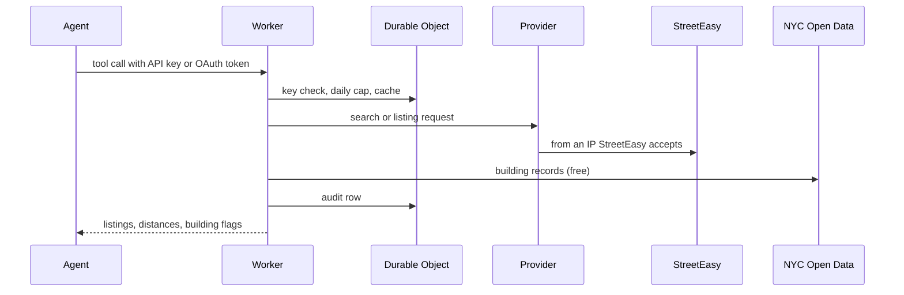

# stoop

Your AI agent hunts NYC apartments. Tell it where you want to live (a neighborhood, a subway stop, ten minutes from the office), your budget and what you can't live without, and it searches live StreetEasy rentals, checks each building's public record for violations, heat complaints, bedbugs and evictions, and brings back the ones worth touring. This Worker makes that happen: deploy it to your own Cloudflare account and any MCP agent gets seven tools, with a daily cap on the requests that cost money.

Unofficial. Not affiliated with StreetEasy. Listing data comes from the private endpoints the StreetEasy website uses; they can change without notice, and you are responsible for your own use and for StreetEasy's terms. Building records come from NYC Open Data and FEMA and describe the whole building, not the unit. The software is provided as is, without warranty of any kind, and its authors are not responsible for how anyone uses it. See [LICENSE](LICENSE).

## Get started

**1. Deploy.**

[](https://deploy.workers.cloudflare.com/?url=https://github.com/jitpal/stoop)

The button clones this repo into your GitHub, creates the storage it needs, asks for the three required secrets (an admin password, a cookie signing key and a [Zyte](https://www.zyte.com/) API key), and deploys. Or from a terminal:

```sh
git clone https://github.com/jitpal/stoop.git && cd stoop && npm install
npx wrangler login
npm run deploy                                # creates the KV namespace and the Durable Object
npx wrangler secret put ADMIN_PASSWORD        # your sign-in for the admin pages
npx wrangler secret put COOKIE_SIGNING_KEY    # openssl rand -hex 32
npx wrangler secret put ZYTE_API_KEY          # or another provider, see below
```

To check the provider before deploying, `ZYTE_API_KEY=... npm run smoke` sends one search and one listing lookup (2 requests) and prints `PASS` or what came back. Open `https://<your-worker>/healthz` afterwards: `ok: true` means config, secrets and storage are in place.

**2. Give your agent access.** Open `https://<your-worker>/admin`, sign in, create an API key on `/admin/keys`, and add the server:

```sh
claude mcp add --transport http stoop https://<your-worker>/mcp \
  --header "Authorization: Bearer stoop_..."
```

Or use OAuth instead of a key. Run the same command without the header and approve it in the browser with the same password. claude.ai, ChatGPT and other hosted connectors only support OAuth.

**3. Ask.** "Find me a one-bedroom under $3,500 within ten minutes of the Bedford L, cats allowed." "Anything no-fee in Greenpoint available by November 1?" "Pull the building record for the second one before I go see it."

## What the agent can do

| Tool | What it does | Cost |
| --- | --- | --- |
| `search_rentals` | Rentals by `neighborhoods`, `near_station` (+ `line`), `near_place` (address, intersection, landmark) or `near_point`, within `radius_minutes` walk. Filters: price, beds, baths, required and nice-to-have amenities, pets, move-in date, no-fee. Each result carries distance, walk time and building flags. | 1 upstream request per StreetEasy page (usually 1–3), cached 15 min |
| `get_listing` | Everything about one listing: description, features, pet policy, price history, days on market, neighborhood median, photos, floor plans, nearest stations, building-record summary. | 1 upstream request, cached 6 h |
| `check_building` | Full public record for a listing or **any NYC address**: overview (PLUTO), HPD violations, 311 complaints with heat by season, bedbugs, evictions, DOB violations, permits and scaffolding, owner and managing agent, FEMA flood zone. | Free with an address |
| `find_station` | "the Bedford L", "Atlantic Terminal", "14th St Union Square" → station, lines, neighborhood. | Free |
| `list_neighborhoods`, `list_amenities` | Reference lookups. | Free |
| `stoop_status` | Provider in use and today's upstream request count. | Free |

## Safety

An agent with access to this spends paid proxy requests on your behalf, so the defaults keep that small and visible.

- **A hard daily cap.** `MAX_UPSTREAM_REQUESTS_PER_DAY` (default 300, retries included) is counted in a Durable Object before every attempt, so it holds even when searches run at once. One search scans at most `MAX_PAGES_PER_SEARCH` pages, and repeat questions come from the cache for free.
- **Read-only.** No tool contacts a landlord or broker, applies, or books a tour. The agent gets the listing URL and you take it from there.
- **Keys are revocable.** Revoke any key with one click on `/admin/keys`. Only a hash of each key is stored.
- **Your provider key never reaches the model.** It lives in Cloudflare secrets and is used only by the Worker.
- **An audit log.** Every tool call is recorded on `/admin/audit` with who made it, the arguments, the outcome and how many paid requests it spent. `/admin` shows today's usage.
- **Facts, not verdicts.** Building reports give counts with dates and sources. A flag of `null` means it could not be checked, not that the building is clean, and the agent is told so.

## How it works

You deploy the Worker to your own Cloudflare account. The agent authenticates to the Worker, and every tool call becomes requests to StreetEasy through your provider and to the city's open data, with keys, caps, the cache and the audit log in a Durable Object.



StreetEasy only filters by neighborhood, so location search is stoop's own: it finds the point (station table, landmark table or NYC Geosearch), searches every neighborhood the radius could touch in one request, and keeps listings whose own coordinates are inside the radius. Walking time is estimated from straight-line distance (× 1.3, 80 m/min). Design and trade-offs are in [docs/DESIGN.md](docs/DESIGN.md).

### Reaching StreetEasy: providers

StreetEasy blocks datacenter IPs, so the Worker sends its StreetEasy requests through a provider. Switch with one var, `UPSTREAM_PROVIDER`:

| Provider | Secrets | Notes |
| --- | --- | --- |
| `zyte` (default) | `ZYTE_API_KEY` | Zyte API with a custom POST body and headers. Verified live. |
| `brightdata` | `BRIGHTDATA_API_KEY` (+ var `BRIGHTDATA_ZONE`) | Web Unlocker REST API. POST pass-through untested; run the smoke test first. |
| `relay` | `RELAY_URL`, `RELAY_TOKEN` | Your own relay on a home connection: `npm run relay` + a Cloudflare Tunnel. Free. |
| `direct` | none | Plain fetch. Only works from a residential IP, e.g. `npm run dev` at home. |

Adding another provider is one function in `src/upstream/providers.ts`.

## Configuration

Vars live in `wrangler.jsonc`, secrets in `wrangler secret put` (or `.dev.vars` for `npm run dev`; see `.dev.vars.example`). For your own deployment, copy `wrangler.jsonc` to `wrangler.local.jsonc` (gitignored); every `npm run` script prefers it, so a custom domain (`routes` plus `PUBLIC_BASE_URL`) or tuned limits never touch the committed file.

| Name | Kind | Default | Purpose |
| --- | --- | --- | --- |
| `UPSTREAM_PROVIDER` | var | `zyte` | `zyte`, `brightdata`, `relay`, `direct` |
| `MAX_UPSTREAM_REQUESTS_PER_DAY` | var | `300` | Daily cap on provider attempts (UTC day), or `unlimited` |
| `UPSTREAM_MAX_RETRIES` | var | `2` | Retries after a bot challenge |
| `MAX_PAGES_PER_SEARCH` | var | `3` | Pages one location search may scan (50 listings each) |
| `BRIGHTDATA_ZONE` | var | `web_unlocker1` | Web Unlocker zone |
| `PUBLIC_BASE_URL` | var | empty | Custom domain, if any |
| `ADMIN_PASSWORD` | secret | required | Signs you in at `/admin` and approves OAuth clients |
| `COOKIE_SIGNING_KEY` | secret | required | Signs the admin cookie and approval forms (32 bytes, hex) |
| `ZYTE_API_KEY`, `BRIGHTDATA_API_KEY`, `RELAY_URL`, `RELAY_TOKEN` | secret | per provider | |
| `SOCRATA_APP_TOKEN` | secret | optional | Higher NYC Open Data rate limits |

Plan note: a search can make up to ~40 outbound requests (StreetEasy pages, one geocode per new building, a few Open Data queries). The free Workers plan allows 50 subrequests per request, which covers light personal use; the $5 paid plan raises it. Cache fills and audit rows are Durable Object SQLite writes, which the free plan allows by the hundred thousand a day.

## What it does not do

- Contact landlords or brokers, apply, or book tours. By design.
- Sales listings. Rentals only.
- Anywhere outside the five boroughs.
- Transit routing. Walk times are estimated from straight-line distance, and "near the L" means near a station on it, not a commute time.
- Promise a listing is still available or accurate. It is what StreetEasy showed at the time, cached for up to 15 minutes.

## Development

```sh
npm run dev              # local Worker on :8787 (UPSTREAM_PROVIDER=direct works from home)
npm run check            # biome + tsc + vitest (tests never touch the network)
npm run check-datasets   # confirm every public dataset and column still exists
```

Bundled data is regenerated by scripts; see [docs/DATA.md](docs/DATA.md).

## Docs

[Design](docs/DESIGN.md) · [Data sources](docs/DATA.md) · [Security policy](SECURITY.md)

## A personal project

This is built for my own use and shared as is. Bug reports are welcome as issues. Pull requests are not accepted and are closed automatically; fork it and change whatever you like, the license allows it. Security problems can be reported privately, see [SECURITY.md](SECURITY.md).

## Thanks

The StreetEasy query shapes are adapted from [evandcoleman/streeteasy-api](https://github.com/evandcoleman/streeteasy-api) and [Alec2435/streeteasy-mcp](https://github.com/Alec2435/streeteasy-mcp) (both MIT). Building records come from [NYC Open Data](https://opendata.cityofnewyork.us/), addresses from [NYC Geosearch](https://geosearch.planninglabs.nyc/), flood zones from [FEMA's National Flood Hazard Layer](https://www.fema.gov/flood-maps/national-flood-hazard-layer), stations from the [MTA's GTFS feed](https://new.mta.info/developers), and neighborhood shapes from [HodgesWardElliott/custom-nyc-neighborhoods](https://github.com/HodgesWardElliott/custom-nyc-neighborhoods). None are affiliated with this project.

MIT. See [LICENSE](LICENSE).
